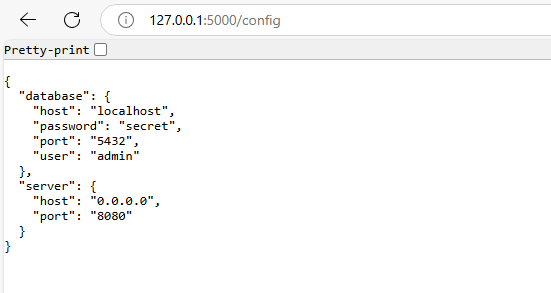

# CPU Usage Monitor, Password Strength Checker, and Configuration Manager

This project contains three Python scripts: one for monitoring CPU usage, another for checking password strength, and another for managing configuration settings.

# Prerequisites

[](https://www.python.org/downloads/)

## Files

- `password_strength.py`: A script to check the strength of a password.
- `cpu_percent.py`: A script to monitor CPU usage and alert if it exceeds a certain threshold.
- `config_manager.py`: A script to manage configuration settings for the other scripts.

## password_strength

This script checks the strength of a password based on the following criteria:
- Minimum length of 8 characters
- Contains at least one digit (0-9)
- Contains both uppercase and lowercase letters
- Contains at least one special character from the set `!@#$%^&*()_-+=,./;[]`

### Run Script

```sh
python password_strength.py
```

### Examples

```python
print(check_password_strength("passwor"))       # Weak: less than 8 characters
print(check_password_strength("password"))      # Weak: no uppercase letter, no digit, no special character
print(check_password_strength("Password123"))   # Weak: no special character
print(check_password_strength("password123"))   # Weak: no uppercase letter
print(check_password_strength("PASSWORD123@"))  # Weak: no lowercase letter
print(check_password_strength("Password123@#")) # Strong
```


## cpu_percent

- In this program continuously monitor the CPU usage of the local machine.
- If the CPU usage exceeds a predefined threshold (e.g., 80%), an alert message should be displayed.
- The program will run indefinitely until interrupted.
- The program has include appropriate error handling to handle exceptions that may arise during the monitoring process.

### Prerequisites

```
pip install psutil
```

### Run Script

```sh
python cpu_percent.py
```

CPU usage is normal: 20.5 %
Alert! CPU usage exceeds threshold: 90.2 %


## config_manager

This script manages configuration settings for the other scripts using a Flask web server.

### Prerequisites

```
pip install flask
pip install configparser
pip install flask-pymongo
```

### Run Script

```sh
python config_manager.py
```

### Examples

1. Start the Flask server:
    
    ```sh
    python config_manager.py
    ```

2. Access the configuration data via the `/config` endpoint: in your web browser or using a tool like `curl` or `Postman`.
    
    ```
    http://127.0.0.1:5000/config
    ```

    

### Code Explanation

- `read_config(file_path)`: Reads the configuration file and returns a `ConfigParser` object.
- `extract_config(config)`: Extracts the configuration data from the `ConfigParser` object and returns it as a dictionary.
- `save_to_json(data, output_file)`: Saves the configuration data to a JSON file.
- `get_config()`: Flask route that reads the configuration file, extracts the data, saves it to a JSON file, and returns the data as a JSON response.

