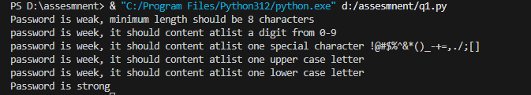
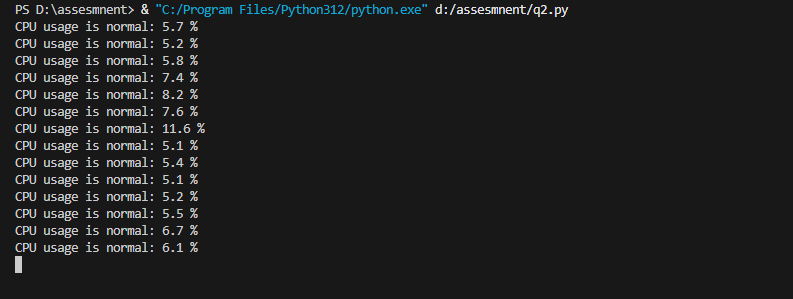

# CPU Usage Monitor and Password Strength Checker

This project contains two Python scripts: one for monitoring CPU usage and another for checking password strength.

# Prerequisites

[](https://www.python.org/downloads/)

## Files

- `password_strength.py`: A script to check the strength of a password.
- `cpu_percent.py`: A script to monitor CPU usage and alert if it exceeds a certain threshold.

## password_strength

This script checks the strength of a password based on the following criteria:
- Minimum length of 8 characters
- Contains at least one digit (0-9)
- Contains both uppercase and lowercase letters
- Contains at least one special character from the set `!@#$%^&*()_-+=,./;[]`

### Run Script

```sh
python password_strength.py
```

### Examples

```python
print(check_password_strength("passwor"))       # Weak: less than 8 characters
print(check_password_strength("password"))      # Weak: no uppercase letter, no digit, no special character
print(check_password_strength("Password123"))   # Weak: no special character
print(check_password_strength("password123"))   # Weak: no uppercase letter
print(check_password_strength("PASSWORD123@"))  # Weak: no lowercase letter
print(check_password_strength("Password123@#")) # Strong
```



## cpu_percent

- In this program continuously monitor the CPU usage of the local machine.
- If the CPU usage exceeds a predefined threshold (e.g., 80%), an alert message should be displayed.
- The program will run indefinitely until interrupted.
- he program should include appropriate error handling to handle exceptions that may arise during the monitoring process.

### Prerequisites

```
pip install psutil
```

### Run Script

```sh
python cpu_percent.py
```

CPU usage is normal: 20.5 %
Alert! CPU usage exceeds threshold: 90.2 %

